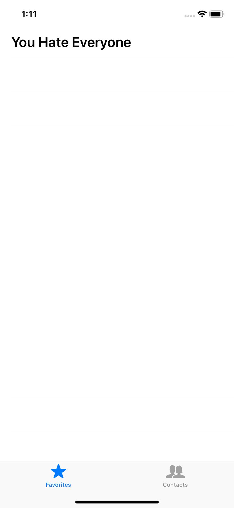
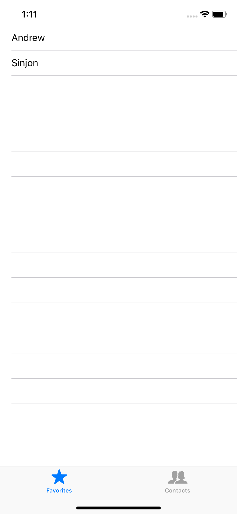
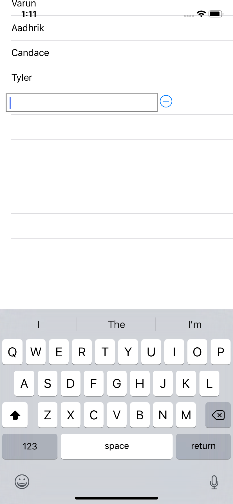
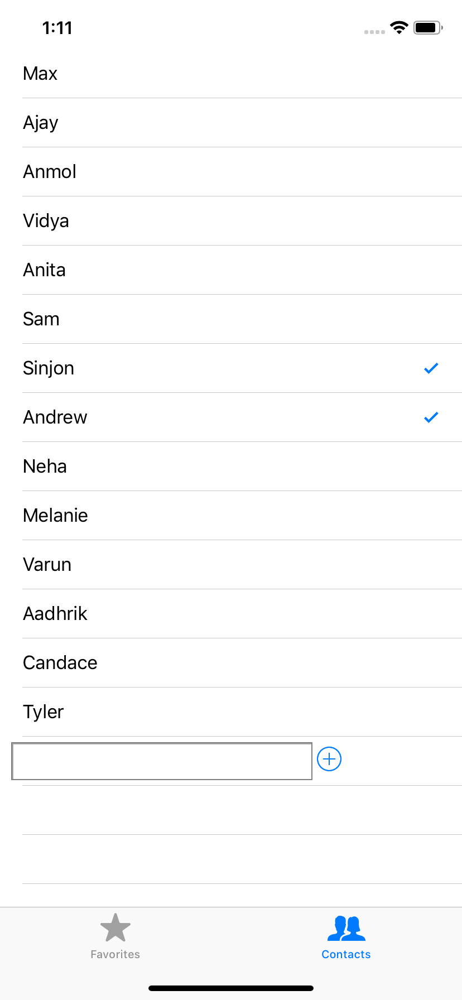

# NotificationCenter-Tutorial
An iOS worksheet which demonstrates NotificationCenter and the delegate pattern. Made for the Mobile Developers of Berkeley iOS Training Program

It covers
- The delegate design pattern for passing information
- NSNotificationCenter
- Accounting for the keyboard on physical devices

# Using the Worksheet
The worksheet is on the master branch. All UI elements have been created for you. Your task is to implement the appropriate delegates and make sure the keyboard won't hide anything important when it shows up.

To fill in the worksheet
- Create a delegate for the `PeopleViewController` so it can update `FavoritesViewController`
  - Implement the delegate methods in `FavoritesViewController`
- Use NotificationCenter to scroll the `PeopleViewController` `UITableView` when the keyboard appears

Solutions to the worksheet can be found on the solutions branch

# Tips
- `UIResponder.keyboardWillHideNotification` and `UIResponder.keyboardWillShowNotification` are the notifications you will need

# Screenshots

<h2>No Favorites</h2> 

<h2>Favorites</h2> 

<h2>Keyboard</h2> 

<h2>Selected Favorites</h2> 

